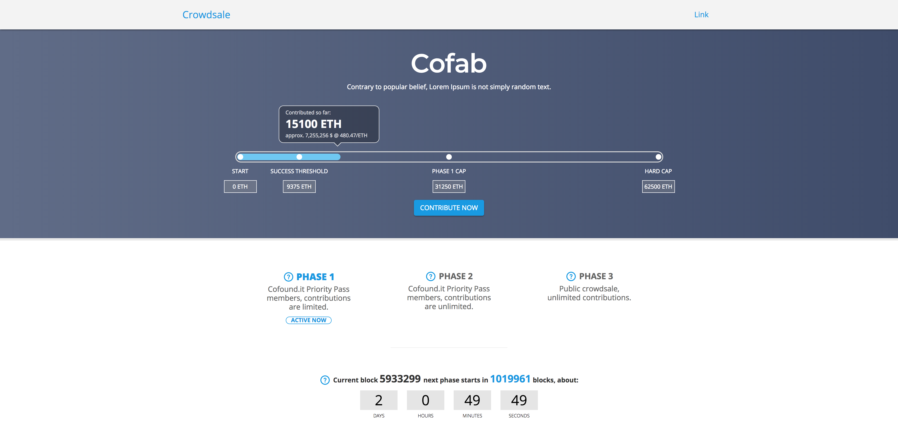

# Crowdsale page

Crowdsale app build on top of create-react-app, usefull for monitoring wallets during a crowdsale. Tailored for crowdsales with multiple phases, the app is equiped with countdowns, contribution sum slider, modal for TOS confirmation, contribution address, blockie & wallet whitelist check.
<br/>
The app is configured to call etherscan every 10 seconds, you can add addresses to the whitelist in `src/modules/others`.
<br/><br/>

<br/>
[View demo](http://crowdsale-demo.s3-website-eu-west-1.amazonaws.com/)

##### Requirements

Get Yarn
https://yarnpkg.com/lang/en

Get Node
https://nodejs.org/en

#### Get started

```
git clone git@github.com:cofablab/crowdsale-page.git
cd crowdsale-page
yarn install
yarn start
```

---

###### Install dependencies with

```
yarn install
```

###### Run development

```
yarn start
```

###### Build bundle

```
yarn build
```

#### Configuration

`src/crowdsales/index.js` Constant for timers, dates, wallets addresses, caps and etherscan API key.

```
const crowdsale = {
  blocks: {
    0: 5933210, // block phase 1
    1: 6953260, // block phase 2
    2: 6963270, // block phase 3
    3: 6973280, // block end of crowdsale
  },
  phases: {
    // utc + 2 = CEST
    0: moment('2018-12-10T14:01Z'), // countdown phase
    1: moment('2018-12-11T14:02Z'), // phase 1
    2: moment('2018-12-12T14:03Z'), // phase 2
    3: moment('2018-12-13T14:04Z'), // phase 3
  },
  caps: {
    min: 0,
    max: 62500,
    successCap: 9375,
    phaseOneCap: 31250,
  },
  eth: {
    ico: '0x9B60874D7bc4e4fBDd162e0F5a12002e4F7715a6',
    sig: '0x02dc3b8ab87c562cdce707647bd1ba21c390faf4',
  },
  etherscanApiKey: '', // your etherscan API key
  googleAnalyticsApiKey: '', // your google analytics API key
}
```

`src/styles/_colors.scss` You can set your primary-color & others

##### Structure

```
crowdsale-page
├── config
│   ├── jest
│   │   ├── cssTransform.js
│   │   └── fileTransform.js
│   ├── env.js
│   ├── paths.js
│   ├── polyfills.js
│   ├── webpack.config.dev.js
│   ├── webpack.config.prod.js
│   └── webpackDevServer.config.js
├── public
│   ├── favicon.png
│   ├── index.html
│   └── manifest.json
├── scripts
│   ├── build.js
│   ├── start.js
│   └── test.js
├── src
│   ├── components
│   │   ├── Banner
│   │   ├── Bar
│   │   ├── Countdown
│   │   ├── Footer
│   │   ├── Infographic
│   │   ├── LimitCheck
│   │   ├── Loader
│   │   ├── Main
│   │   ├── Modal
│   │   ├── OnPhase
│   │   ├── Phases
│   │   ├── Promo
│   │   ├── Slider
│   │   ├── SocialLinks
│   │   ├── Terms
│   │   ├── TextInput
│   │   ├── TopNav
│   │   └── Warning
│   ├── crowdsale
│   │   └── index.js
│   ├── fonts
│   │   ├── glyphicons-halflings-regular.eot
│   │   ├── glyphicons-halflings-regular.svg
│   │   ├── glyphicons-halflings-regular.ttf
│   │   ├── glyphicons-halflings-regular.woff
│   │   └── glyphicons-halflings-regular.woff2
│   ├── img
│   │   ├── cofab.svg
│   │   ├── copy.png
│   │   ├── ethereum-logo.png
│   │   ├── favicon.png
│   │   ├── icon-error.png
│   │   ├── icon-quest.png
│   │   ├── infographic.png
│   │   ├── logo-facebook.svg
│   │   ├── logo-instagram.svg
│   │   ├── logo-medium.svg
│   │   ├── logo-reddit.svg
│   │   ├── logo-telegram.svg
│   │   ├── logo-twitter.svg
│   │   ├── logo-youtube.svg
│   │   ├── paste.png
│   │   ├── screenshot.png
│   │   └── tooltip.png
│   ├── store
│   │   ├── modules
│   │   │   ├── etherscan
│   │   │   │   └── index.js
│   │   │   ├── form
│   │   │   │   └── index.js
│   │   │   ├── others
│   │   │   │   └── index.js
│   │   │   ├── phases
│   │   │   │   └── index.js
│   │   │   └── index.js
│   │   ├── api.js
│   │   ├── promiseMiddleware.js
│   │   └── store.js
│   ├── styles
│   │   ├── _banner.scss
│   │   ├── _bar.scss
│   │   ├── _blockies.scss
│   │   ├── _colors.scss
│   │   ├── _countdown.scss
│   │   ├── _custom.scss
│   │   ├── _founded.scss
│   │   ├── _limit-check.scss
│   │   ├── _loader.scss
│   │   ├── _modal.scss
│   │   ├── _slider.scss
│   │   ├── _text_animations.scss
│   │   └── _topnav.scss
│   ├── utils
│   │   ├── errorMessages.js
│   │   └── validator.js
│   ├── App.css
│   ├── App.js
│   ├── App.scss
│   ├── index.css
│   ├── index.js
│   └── registerServiceWorker.js
├── LICENSE
├── README.md
├── package.json
├── screenshot.png
└── yarn.lock
```

Find more tools like that on [Cofab](https://cofablab.com/)
